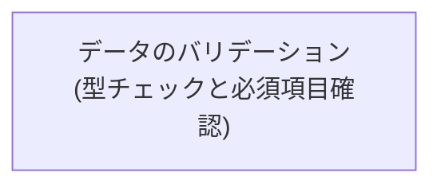
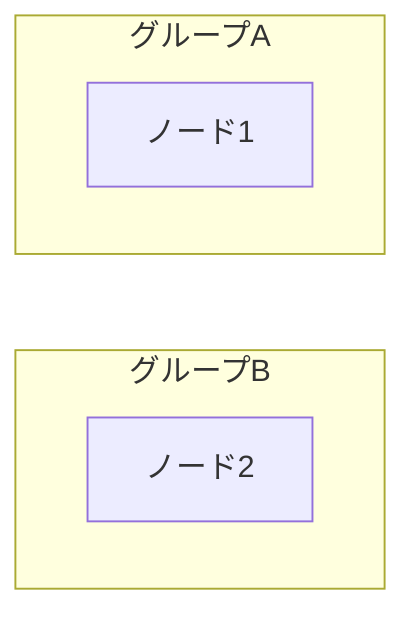
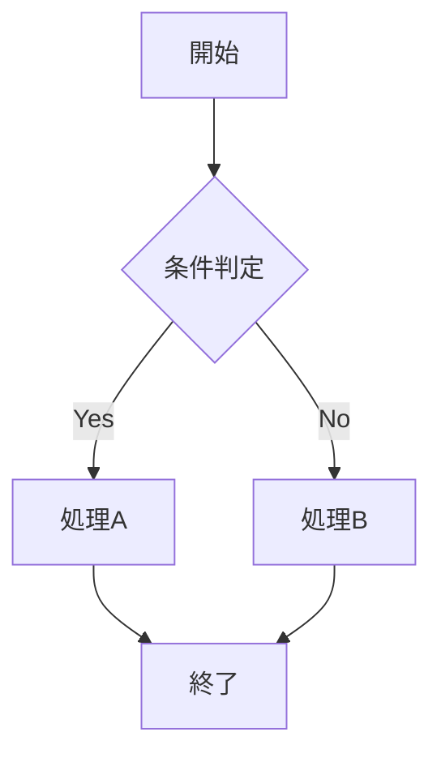
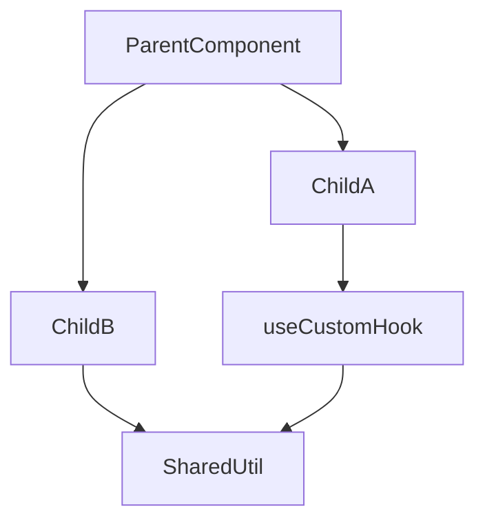
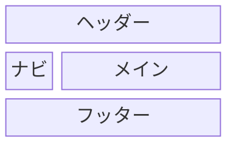
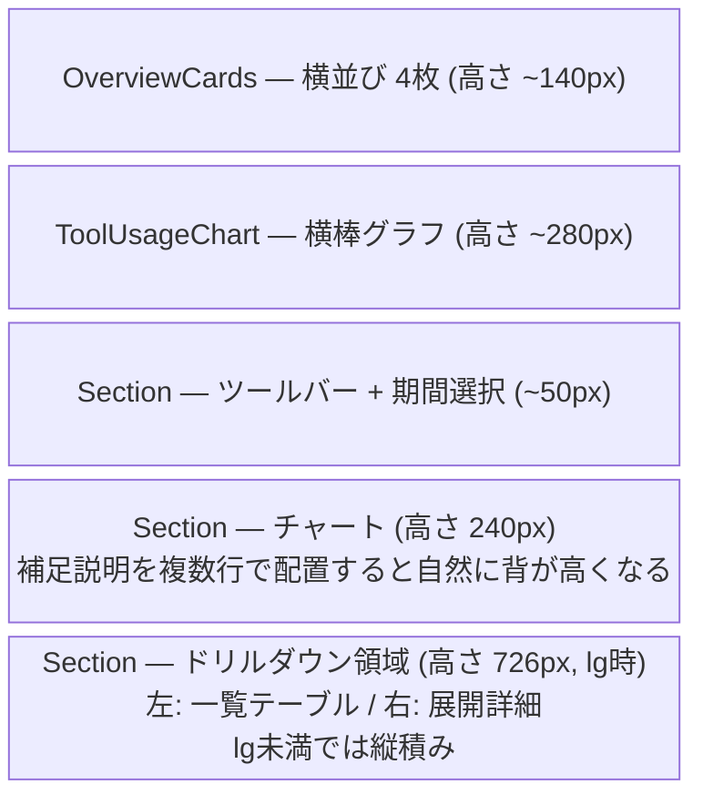
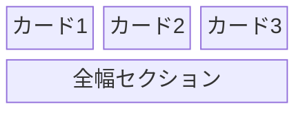
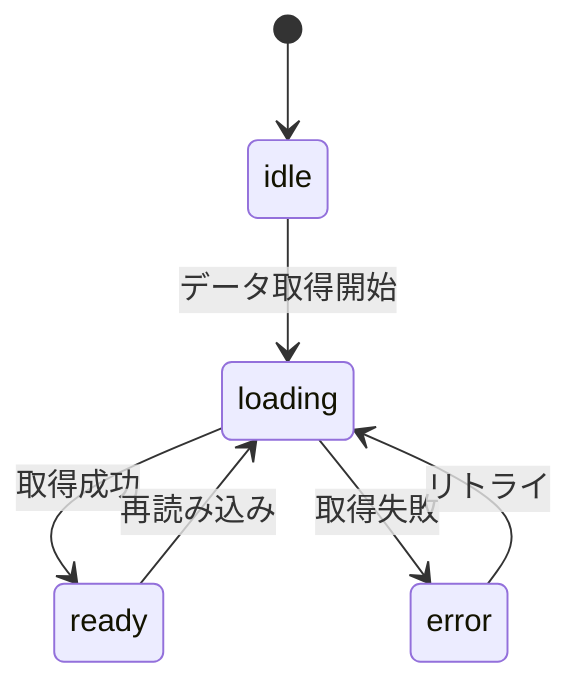
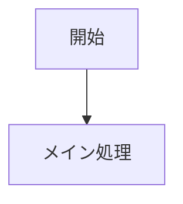

---
path: "**/*.md"
---

# Mermaid 図解 可読性向上ガイドライン

更新日: 2026-04-20

---

## 1. 基本方針

- 設計書は **Markdown + Mermaid** で完結させる。Claude Code が直接読み書きでき、GitHub プレビューで視覚確認でき、git 差分で変更履歴を追跡できる
- 図はすべて **Mermaid** で記述する。テキストベースなのでバージョン管理・差分確認・レビューが容易
- スクリーンショット画像は設計段階では使わず、Mermaid（`block-beta` 等）で箱構成を代替する
- 条件分岐・パラメータ・状態一覧など **網羅的な一覧性が必要な情報は Markdown テーブル** を併用する。Mermaid に押し込めない

## 2. 図の種類と使い分け

設計対象ごとに最適な図種を選ぶ。Mermaid には多くの図種があるが、本ガイドラインでは以下の 4 つに集約する。

| 設計対象 | 推奨図種 | 用途例 |
| --- | --- | --- |
| ロジックフロー・依存関係 | `flowchart` | 処理フロー、分岐判断、アーキテクチャ依存 |
| 画面レイアウト | `block-beta` | UI セクション分割、カラム構成、画面設計書 |
| 状態遷移 | `stateDiagram-v2` | エディタモード、ライフサイクル、非同期処理 |
| コンポーネント構成 | `flowchart` or `graph` | コンポーネント依存、モジュール関係 |
| 条件分岐・ビジネスロジック | Markdown テーブル（**Mermaid ではなく**） | diff 種別表示色、パラメータ仕様 |

> [!IMPORTANT]
> 画面設計書（\`type: "spec"\` の画面レイアウト仕様）では \`block-beta\` を使用し、\`flowchart\` で代替しないこと。

## 3. 共通ルール（すべての図種で適用）

### 3.1 ラベル内の HTML タグ制約（strict モード）

本プロジェクトでは `securityLevel: "strict"` で Mermaid を実行している。\
`strict` モードでは ` ` 以外の HTML タグ（`<small>`, `<b>`, `<i>` 等）がエスケープされ、レンダリングに失敗する。

- ラベル内で使用できる HTML タグは ` ` **のみ**
- `<small>` 等で副題を表現したい場合は、` ` の後に括弧書きで代替する
- `>` や `<` を含める場合は HTML エンティティ（`&gt;` / `&lt;`）でエスケープする（例: `totalCommits&gt;0`）

> Mermaid Live Editor は `securityLevel` が異なるため `<small>` 等が表示されるが、本プロジェクトでは動作しない。

### 3.2 横幅の制約（900px 以内）

図の描画幅が **900px を超えないように** 配置を設計する。\
900px はエディタの md ブレークポイント（A4 余白付き本文幅 643px 〜 A3 全幅 1122px の中間帯）であり、この幅に収まれば横スクロールなしで閲覧できる。

**幅を抑える手法:**

- `LR`（横方向）より `TD`（縦方向）を優先する。ステップ数が多いフローは縦に伸ばす
- ノードラベルは短く保ち、` ` で改行して横幅を抑える
- 横に並ぶノード数は **4個以内** を目安とする。超える場合は2段に分ける

### 3.3 ノード密度の管理

- 1枚の図に収めるノードは **15個以内** を推奨
- 複雑になる場合は `subgraph`（flowchart）で分割するか、図自体を分割する

### 3.4 ラベルの簡潔化と情報集約

- ID（短い英数字）と表示名（ラベル）を分離して管理する
- 「タイトル」と「説明文」を別ノードに分けず、1つのノード内で ` ` を使用して記述する

### 3.5 図と補足テーブルの組み合わせ

Mermaid 図だけでは表現しきれない詳細仕様は、直後に Markdown テーブルを置いて補完する。\
図 → テーブル の流れを定着させると、設計書の網羅性と検索性が両立する。

| 図種 | 併用するテーブルの例 |
| --- | --- |
| `flowchart`（ロジック） | 入力パラメータ仕様・出力仕様・エッジケース・制約 |
| `block-beta`（画面） | 各エリアの要素と動作・インタラクション・レスポンシブ条件 |
| `stateDiagram-v2`（状態遷移） | 状態一覧と進入条件・遷移時の副作用 |
| `flowchart`（コンポーネント） | コンポーネント一覧（責務・Props・行数目安）・データフロー |

## 4. `flowchart` によるフロー・依存関係図

### 4.1 方向（Direction）の最適化

- `TD` / `TB` (Top Down): 組織図、決定木、上から下への時系列フローに最適
- `LR` (Left to Right): プロセス、データ遷移、ステップ数が多いフローに最適

### 4.2 論理的な形状の使い分け

| 形状 | 構文 | 用途 |
| --- | --- | --- |
| 四角 | `[ ]` | 通常の処理、ステップ |
| ひし形 | `{ }` | 分岐、条件判断 |
| 丸角 | `([ ])` | 開始、終了地点 |

### 4.3 `subgraph` による境界線

「フロントエンド」「バックエンド」「外部API」などの論理的境界を明確にする。\
並列ノードが多い階層は `subgraph` で分割し、縦に並べ直す。

### 4.4 配置の強制（インビジブルリンク）

同じ階層に並べたい場合や複数の `subgraph` の縦配置を強制したい場合、ダミーの接続（`~~~`）を使用する。

### 4.5 線の種類の使い分け

| 線種 | 構文 | 用途 |
| --- | --- | --- |
| 実線 | `-->` | メインフロー、強い依存関係 |
| 点線 | `-.->` | 補足情報、非同期処理、オプション |
| 太線 | `==>` | 強調、ハッピーパス（正常系） |

### 4.6 交差の削減

すべてのノードを直接結ぶのではなく、共通のハブ（中継点）ノードや `subgraph` への接続を活用して線をまとめる。

### 4.7 ロジック設計・コンポーネント設計での使用例

**ロジックフロー:**

**コンポーネント依存関係:**

## 5. `block-beta` による画面レイアウト

### 5.1 基本構文

- `columns N`: グリッドの列数を定義
- `ブロック名["ラベル"]:N`: N 列ぶん水平に span
- 行は上から順に自動配置される

### 5.2 `style ... height:Npx` は使わない（**禁止**）

> [!IMPORTANT]
> \`block-beta\` では \`style ブロック名 height:Npx\` を \*\*使用してはいけない\*\*。\\ ラベル文字列が箱の外にはみ出して表示される描画バグを誘発し、レイアウトが崩壊する。

### 5.3 高さ表現の 3 手段

`style height` の代わりに、以下の手段で画面の縦比率を表現する。

1. **ラベル行数による自然な高さ調整**\
   ` ` を複数入れて内容を増やすと、箱が auto-size で縦方向に伸びる。タイトル + 補足 + 寸法注記で 3〜6 行にすると画面セクションに近い比率が得られる

2. **複数ブロックへの縦分割**\
   縦に長いセクション（例: `DailySessionList 726px`）は 1 つの箱に押し込めず、`Header → Chart → Drilldown` のように **3〜4 個の箱に縦分割** して視覚的な高さを稼ぐ

3. **寸法はラベル内テキストで明記**\
   `"チャート 高さ 240px"` のように括弧書き／ピクセル値をラベルに含め、実画面との対応を読み手に伝える

### 5.4 カラム構成の例

**全体レイアウト（1カラム縦積み、縦分割で高さ表現）:**

**2 カラム構成:**

**3 カラム + 全幅セクション:**

## 6. `stateDiagram-v2` による状態遷移図

### 6.1 基本構文

- `[*]` は初期・終了状態
- `状態A --> 状態B: イベント` でラベル付き遷移を記述
- 並列状態は `state "名前" as ID` で別名定義

### 6.2 補足テーブルの併用

状態遷移図は遷移の構造を示すが、**状態の意味と副作用** は図では表現しづらい。\
必ず以下のテーブルと併用する。

- 状態一覧（状態・説明・進入条件）
- 遷移時の副作用（UI 変更、外部通知、タイマー開始等）

## 7. 視覚的セマンティクス（色とグループ）

### 7.1 カラースキームの統一

`classDef` を定義し、役割ごとに色を固定する。

> 例: 入力＝青、エラー＝赤

### 7.2 スタイル値の最小化

派手な色は避け、薄い背景色と濃い枠線の組み合わせを基本とする。

## 8. コーディング規約（メンテナンス性）

### 8.1 インデントの徹底

`subgraph` 内の要素や `block-beta` の `block:` 内の要素は必ずインデントする。

### 8.2 定義と接続の分離

ノードの定義（ラベル管理）と接続の定義（構造管理）を分けて記述する。

## 9. セルフチェックリスト

### 9.1 共通（すべての図種）

- [ ] 図の種類が用途に合っているか（フロー → `flowchart` / 画面 → `block-beta` / 状態 → `stateDiagram-v2`）
- [ ] ラベルに ` ` 以外の HTML タグが混入していないか
- [ ] `>` `<` が HTML エンティティでエスケープされているか
- [ ] 描画幅が 900px 以内に収まっているか
- [ ] ノード数が 15個以内か
- [ ] 図だけで説明不足な箇所は補足テーブルで補っているか

### 9.2 `flowchart` 向け

- [ ] 方向（`TB` / `LR`）が最適か
- [ ] `subgraph` で論理的なまとまりが作られているか
- [ ] 重要なパスが太線や色で区別されているか
- [ ] 線の交差が最小化されているか

### 9.3 `block-beta`（画面設計書）向け

- [ ] `flowchart` で代替せず `block-beta` を使っているか
- [ ] `style X height:Npx` を使っていないか（**禁止**）
- [ ] 縦に長いセクションは複数ブロックに分割しているか
- [ ] 各箱のラベルに寸法注記（`(高さ NNpx)` 等）が含まれているか

### 9.4 `stateDiagram-v2` 向け

- [ ] 初期状態 `[*] -->` と終了状態が明示されているか
- [ ] 遷移に **イベント名** がラベル付けされているか
- [ ] 状態一覧と副作用のテーブルが併記されているか
