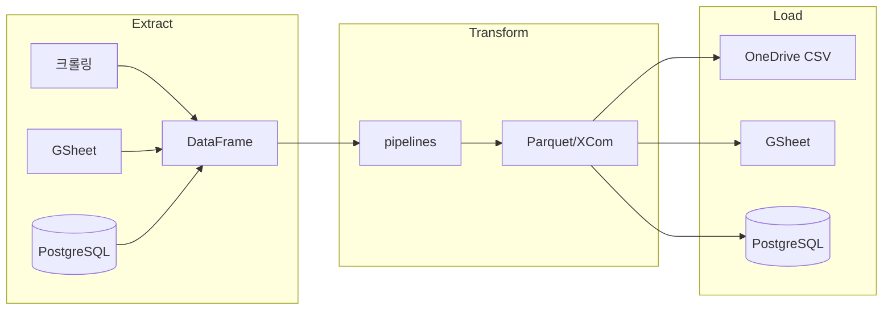

# Airflow 프로젝트



## 프로젝트 구조
- `dags/` - DAG 정의 (sales, strategy, db)
- `modules/` - 비즈니스 로직 (extract, transform, load)
- `scripts/` - 단발성 분석/검증 스크립트
- `docs/` - 아키텍처, DB 스키마, 의사결정 기록

## 가상환경 규칙
- Windows: `.venv` → `.\.venv\Scripts\activate`
- WSL: `.venv_wsl` → `source .venv_wsl/bin/activate`
- **교차 사용 절대 금지** (Win↔WSL 가상환경 혼용 불가)

## 운영 기준
- Windows = 개발/수정 (VSCode)
- WSL = 실행/자동화 (`cc` 명령으로 진입, `.venv_wsl` 자동 활성화)
- WSL 최초 세팅: `bash /mnt/c/airflow/setup_wsl.sh`

## 실행 명령 (WSL)
```bash
docker compose up -d                    # Airflow 컨테이너 시작
docker compose logs -f scheduler        # 스케줄러 로그 확인
docker exec airflow-airflow-scheduler-1 airflow dags trigger {DAG_ID}  # DAG 수동 트리거
docker exec airflow-airflow-worker-1 bash -c "cat '/opt/airflow/logs/dag_id={DAG}/run_id={RUN}/task_id={TASK}/attempt=1.log'"  # 태스크 로그 확인
# UI: http://localhost:8080  (id: airflow / pw: airflow)
```

## 크롤링 DAG 특이사항
- Chrome 프로파일: `/opt/airflow/chrome_profiles/{account_id}/`
- Xvfb 가상 디스플레이: 배민 headless 봇 탐지 우회 (`:99`)
- 새 크롤링 DAG 작성 시 `/crawl` skill 필수 사용

## 배민 수집 파이프라인 (DB_Beamin_Macro_Dags)
- 단일 브라우저 세션: login → now → 우가클 → 변경이력 → logout
- 저장: `analytics/baemin_macro/{metrics_now,metrics_our_store_clicks,shop_change}/`

## DAG 수동 트리거 conf 패턴
- `{"sale_date": "YYYY-MM-DD"}` → 정정 모드 (overwrite=True)
- `{"backfill": true}` → 전체 백필 모드
- conf 없음 → Lookback N일 누락 append 모드

## 참조
- `docs/architecture.md` - ETL 흐름 + 모듈 구조도
- `docs/db-schema.md` - DB/경로 참조


## 읽기 제외
- `.claudeignore`

---

## AI 행동 지침

> 이 지침은 일반적인 LLM 코딩 실수를 줄이기 위한 행동 원칙이다.
> **원칙: 속도보다 신중함을 우선한다. 단, 사소한 작업은 판단에 맡긴다.**

### 1. 코딩 전에 먼저 생각하라
가정하지 마라. 혼란을 숨기지 마라. 트레이드오프를 드러내라.

구현 전에:
- 가정 사항을 명시적으로 밝혀라. 불확실하면 물어봐라.
- 해석이 여러 가지라면 모두 제시하라 - 조용히 하나를 고르지 마라.
- 더 단순한 방법이 있다면 말하라. 필요하다면 반론을 제기하라.
- 뭔가 불명확하면 멈춰라. 무엇이 혼란스러운지 밝히고 물어봐라.

### 2. 단순함을 우선하라
문제를 해결하는 최소한의 코드만 작성하라. 추측성 코드는 금지.

- 요청 이상의 기능은 추가하지 마라.
- 일회성 코드에 추상화를 만들지 마라.
- 요청하지 않은 "유연성"이나 "설정 가능성"을 넣지 마라.
- 불가능한 시나리오에 대한 에러 처리는 하지 마라.
- 200줄로 썼는데 50줄로 가능하다면, 다시 써라.
- 스스로 물어봐라: "시니어 엔지니어가 보면 과하다고 할까?" 그렇다면 단순화하라.

### 3. 외과적 변경만 하라
반드시 건드려야 할 것만 수정하라. 자신이 만든 지저분함만 정리하라.

기존 코드 수정 시:
- 인접한 코드, 주석, 포맷팅을 "개선"하지 마라.
- 고장나지 않은 것은 리팩터링하지 마라.
- 자신이라면 다르게 하더라도 기존 스타일을 맞춰라.
- 관련 없는 dead code를 발견하면 언급만 하라 - 지우지 마라.

자신의 변경으로 고아(orphan)가 생겼을 때:
- **자신의 변경으로 인해** 사용되지 않게 된 import/변수/함수는 제거하라.
- 기존에 이미 존재하던 dead code는 요청이 없으면 건드리지 마라.

기준: 변경된 모든 줄이 사용자의 요청으로 직접 추적 가능해야 한다.

### 4. 목표 중심으로 실행하라
성공 기준을 정의하라. 검증될 때까지 반복하라.

작업을 검증 가능한 목표로 변환하라:
- "유효성 검사 추가" → "잘못된 입력에 대한 테스트 작성 후 통과시키기"
- "버그 수정" → "버그를 재현하는 테스트 작성 후 통과시키기"
- "X 리팩터링" → "전후 테스트 모두 통과 확인"

복수 단계 작업은 간략한 계획을 먼저 밝혀라:
```
1. [단계] → 검증: [확인 방법]
2. [단계] → 검증: [확인 방법]
3. [단계] → 검증: [확인 방법]
```

강한 성공 기준은 독립적으로 반복할 수 있게 한다.
약한 기준("되게 만들어")은 실수 후 계속 재확인을 요구한다.
