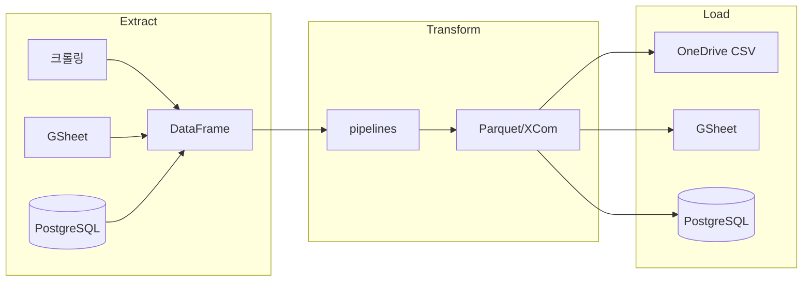

# Airflow 프로젝트



## 프로젝트 구조
- `dags/` - DAG 정의
  - `sales/`, `strategy/`, `db/` — 도메인별 DAG
  - `etl/` — 마이그레이션/ETL 유틸 | `private/` — 내부 전용
- `modules/` - 비즈니스 로직 (extract, transform, load)
- `scripts/` - 단발성 분석/검증 스크립트
- `docs/` - 아키텍처, DB 스키마, 의사결정 기록

## Codex 경계
- `AGENTS.md`, `docs/codex/**`, `codex-skills/**`는 Codex/로컬 에이전트 전용 운영 문서
- Claude는 위 경로를 프로젝트 규칙의 우선 출처로 사용하지 않음
- 같은 주제가 양쪽에 있으면 `CLAUDE.md` 계열만 따름
- Codex 전용 문서는 Claude 세션 메모, 요약, 자동 개선 대상에 포함하지 않음
- 사용자가 명시적으로 검토를 요청한 경우에만 읽을 수 있으나 Claude 작업 규칙으로 승격하지 않음

## 가상환경 규칙
- Windows: `.venv` → `.\.venv\Scripts\activate`
- WSL: `.venv_wsl` → `source .venv_wsl/bin/activate`
- **교차 사용 절대 금지** (Win↔WSL 가상환경 혼용 불가)

## 운영 기준
- Windows = 개발/수정 (VSCode)
- WSL = 실행/자동화 (`cc` 명령으로 진입, `.venv_wsl` 자동 활성화)
- WSL 최초 세팅: `bash /mnt/c/airflow/setup_wsl.sh`

## 팀원 최초 설정
1. `.env.example`을 `.env`로 복사한 뒤 `.env`만 수정한다.
   ```powershell
   copy .env.example .env
   notepad .env
   ```
2. `ONEDRIVE_ROOT`를 본인 PC의 OneDrive 경로로 바꾼다.
   ```env
   ONEDRIVE_ROOT=c:/Users/팀원계정/OneDrive - 주식회사 도리당
   ```
3. `c:/Local_DB`, `c:/Doridang`, `e:/down`, `e:/d_down` 폴더가 없으면 만들거나 `.env`에서 대체 경로로 바꾼다.
4. 개인 PC 경로 때문에 `docker-compose.yaml`을 직접 수정하지 않는다. 개인 설정은 `.env`에만 둔다.
5. WSL 세팅 후 `docker compose up -d`로 실행한다.

## 실행 명령 (WSL)
```bash
docker compose up -d                    # Airflow 컨테이너 시작
docker compose logs -f scheduler        # 스케줄러 로그 확인
docker exec airflow-airflow-scheduler-1 airflow dags trigger {DAG_ID}  # DAG 수동 트리거
docker exec airflow-airflow-worker-1 bash -c "cat '/opt/airflow/logs/dag_id={DAG}/run_id={RUN}/task_id={TASK}/attempt=1.log'"  # 태스크 로그 확인
# UI: http://localhost:8080  (id: airflow / pw: airflow)
```

## 크롤링 DAG 특이사항
- Chrome 프로파일: `/opt/airflow/chrome_profiles/{account_id}/`
- Xvfb 가상 디스플레이: 배민 headless 봇 탐지 우회 (`:99`)
- 새 크롤링 DAG 작성 시 `/crawl` skill 필수 사용

## 배민 수집 파이프라인 (DB_Beamin_Macro_Dags)
- 매장별 독립 Chrome 세션 (OOM 방지): 1단계(매장목록) → 2단계(now+우가클+변경이력) → 3단계(orders 정상+취소) → 4단계(ad_funnel)
- 저장: `analytics/baemin_macro/{metrics_now,metrics_our_store_clicks,shop_change,orders,ad_funnel}/`
- ad_funnel: `stat/advertisement` 페이지, 노출수·클릭수·주문수·주문금액, 월별 CSV upsert by target_date
- 우가클 KNOWN_BRANDS: `["도리당", "나홀로"]` (광고 미집행 매장은 `DOM={"tr":0}` 정상)

## 배민 크롤링 Gotcha
- 배민 우가클 테이블: Selenium `.text` 빈값 → `.get_attribute("innerText")` 필수
- `전체보기` 버튼도 `.text` 빈값 → `b.get_attribute("innerText")`로 찾아야 함
- SPA 상태 꼬임 시: 대시보드 경유 후 재시도 (`driver.get("https://self.baemin.com/")`)
- orders 가게+상태 필터: `FilterContainer-module__ccrG` 하나의 통합 팝업 — 가게·주문취소 상태 함께 처리
- orders 주문취소: `input[name="status"][value="CANCELLED"]` readonly → `label[for=id].click()` 필수
- ad_funnel `Filter-module__lRdH` 버튼 **2개 독립**: [0]=노출수·클릭수, [1]=주문수·주문금액 각각 설정
- ad_funnel DAILY 라디오(readonly) 클릭 후 **0.5s sleep 필수** — React 배치 업데이트 완료 대기

## DAG 수동 트리거 conf 패턴
- `{"sale_date": "YYYY-MM-DD"}` → 정정 모드 (overwrite=True)
- `{"backfill": true}` → 전체 백필 모드
- conf 없음 → Lookback N일 누락 append 모드

## 참조
- `docs/architecture.md` - ETL 흐름 + 모듈 구조도
- `docs/db-schema.md` - DB/경로 참조


## Posfeed Whitelist LLM 분류
- 신규 item_name 발견 시 Ollama(`qwen_client`)가 브랜드 맥락으로 자동 Y/N 판정
- CSV 컬럼: `item_name, is_valid, store, review_needed, classified_by`
- `review_needed=Y` → 이메일 알림 → 검토 후 N으로 변경 (`is_valid` 틀렸으면 같이 수정)
- DAG 재실행 시 `sync_posfeed_blacklist`가 `is_valid=N` 항목 parquet 소급 삭제

## daily_summary.parquet (PowerBI 핵심 파일)
- 경로: `MART_DB/unified_sales_grp/daily_summary.parquet`
- 생성: `build_daily_summary()` → DAG `DB_UnifiedSales` t9
- 컬럼 분류:
  - **Additive (SUM 가능)**: `total_price`, `order_cnt`, `expected_month_sales`, `expected_week_sales`
  - **Non-additive (MAX 사용)**: `store_expected_month_sales`, `store_expected_week_sales`
- PowerBI 예상누적매출: `MAX(store_expected_month_sales)` groupby `store×brand×ym`
- `store_expected_month_sales` = `bdf["es"]` (store 전체 tp / store max_day × 말일) — 채널별 SUM 아님

## 읽기 제외
- `.claudeignore`
