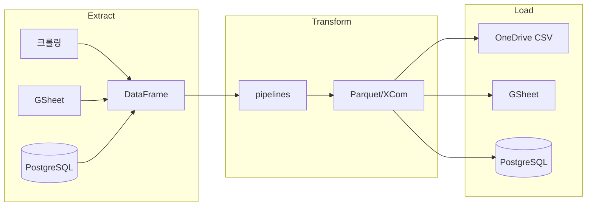

# Airflow 프로젝트

## 프로젝트 구조
- `dags/` - DAG 정의 (sales, strategy, etl, db)
- `modules/` - 비즈니스 로직 (extract, transform, load)
- `scripts/` - 단발성 분석/검증 스크립트
- `docs/` - 아키텍처, DB 스키마, 의사결정 기록

## 가상환경 규칙
- Windows: `.venv` → `.\.venv\Scripts\activate`
- WSL: `.venv_wsl` → `source .venv_wsl/bin/activate`
- **교차 사용 절대 금지** (Win↔WSL 가상환경 혼용 불가)

## 운영 기준
- Windows = 개발/수정 (VSCode)
- WSL = 실행/자동화 (`cc` 명령으로 진입)
- WSL 최초 세팅: `bash /mnt/c/airflow/setup_wsl.sh`

## 참조
- `docs/architecture.md` - ETL 흐름 + 모듈 구조도
- `docs/db-schema.md` - DB/경로 참조