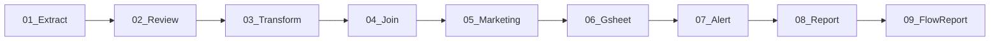

# DAG 규칙

## 구조
- `dag_id=Path(__file__).stem`, `catchup=False`, `max_active_runs=1`
- schedule: `schedule.py` 상수 사용, 로직은 `modules/transform/pipelines/`

## 네이밍
- 영업: `Sales_{DOMAIN}_{##}_{STAGE}_Dags.py` → `dags/sales/`
- 전략: `Strategy_{DOMAIN}_{##}_{STAGE}_Dags.py` → `dags/strategy/`
- STAGE: Extract → Transform → Gsheet / Load / Alert / Report

## 참조
- `docs/architecture.md` - 아키텍처/모듈 구조도
