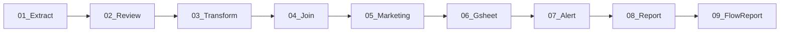

# DAG 규칙

## 구조
- `dag_id=Path(__file__).stem`, `catchup=False`, `max_active_runs=1`
- schedule: `schedule.py` 상수 사용, 로직은 `modules/transform/pipelines/`

## 네이밍
- 영업: `Sales_{DOMAIN}_{##}_{STAGE}_Dags.py` → `dags/sales/`
- 전략: `Strategy_{DOMAIN}_{##}_{STAGE}_Dags.py` → `dags/strategy/`
- DB 수집: `DB_{Source}_Dags.py` → `dags/db/`
- STAGE: Extract → Transform → Gsheet / Load / Alert / Report

## conf 파라미터 패턴
- `{"sale_date": "YYYY-MM-DD"}` → 정정 모드 (overwrite=True)
- `{"backfill": true}` → 전체 백필 모드
- conf 없음 → Lookback N일 누락 append 모드

## 폴더
- `sales/`, `strategy/`, `db/` — 도메인별 일반 DAG
- `etl/` — 마이그레이션/ETL 유틸 | `private/` — 내부 전용

## 크롤링 DAG (DB_*) 패턴
- `combined.py` 패턴: 매장별 독립 Chrome (OOM 방지), 4단계 구조
  - 1단계: 매장목록 조회 → 2단계: now+우가클+변경이력(per-store) → 3단계: orders
- 크롤링 DAG 신규 작성 전 `/crawl` skill로 대상 URL 사전 조사 필수

## 참조
- `docs/architecture.md` - 아키텍처/모듈 구조도
