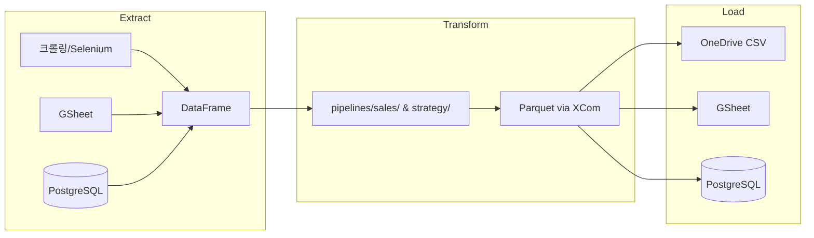
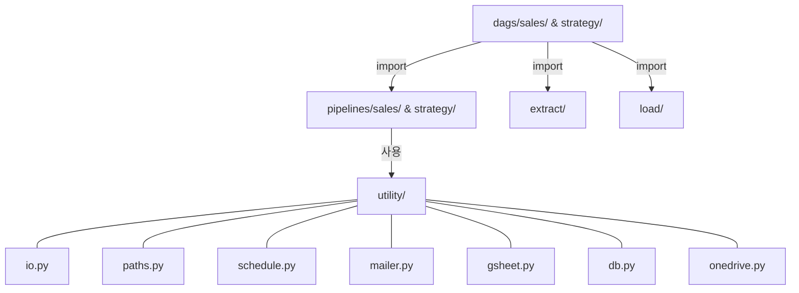

# 아키텍처

## ETL 흐름

## 모듈 구조

## utility 선택 기준
| 필요한 것 | 파일 |
|---------|------|
| 경로 상수 | paths.py |
| 파일 로드/저장 | io.py |
| 스케줄 상수 | schedule.py |
| 이메일 발송 | mailer.py |
| GSheet 읽기/쓰기 | gsheet.py |
| DB 조회/저장 | db.py |
| OneDrive CSV | onedrive.py |
