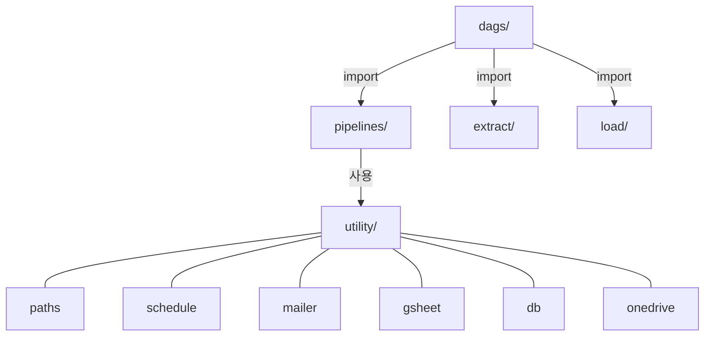

# 모듈 규칙

## 폴더 역할
- `transform/utility/` - 공통 함수
  - paths, schedule, mailer, gsheet, db, onedrive — ETL 기본
  - store_normalize — 매장명 정규화 Single Source of Truth (STORE_NAME_MAP)
  - playwright_launcher, selenium_uc — 브라우저 자동화
  - analytics, account — 분석/계정 유틸
  - qwen_client — LLM 클라이언트
- `transform/pipelines/` - 비즈니스 로직 (sales: SMD_*, strategy: SMP_*)
- `transform/pipelines/db/` - DB 수집 파이프라인
  - DB_UnifiedSales_*.py: 소스별 모듈 분리 (okpos/unionpos/easypos/posfeed/toorder)
  - DB_UnifiedSales_common.py: 공통 스키마·저장 함수 (_save_unified_daily 등)
- `extract/` - 크롤링 + GSheet/DB 래퍼 | `load/` - 적재 래퍼

## 새 파이프라인 추가
- `pipelines/sales/` 또는 `strategy/`에 생성, 반환: str 또는 DataFrame

## 크롤링 모듈 규칙
- 새 크롤링 파이프라인 작성 전 `/crawl` skill 필수 (URL 구조·API 사전 검증)
- `croling_beamin.py` - launch_browser / login / logout / get_store_options 공통 함수
- DB 크롤링은 `combined.py` 패턴: 단일 세션에서 여러 수집 함수 순차 호출

## 참조
- `docs/architecture.md` - utility 선택 기준표
- `docs/db-schema.md` - DB/경로 참조
