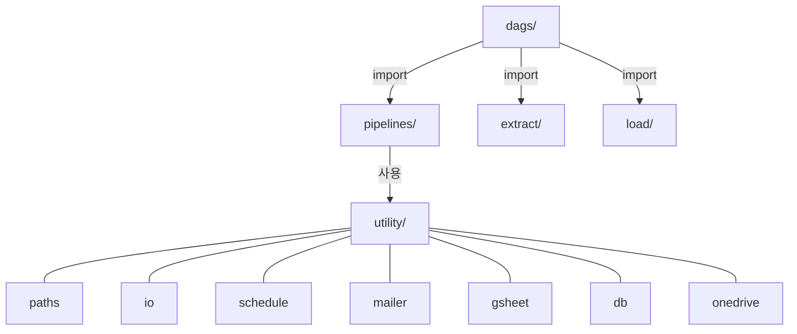

# 모듈 규칙

## 폴더 역할
- `transform/utility/` - 공통 함수 (paths, io, schedule, mailer, gsheet, db, onedrive)
- `transform/pipelines/` - 비즈니스 로직 (sales: SMD_*, strategy: SMP_*)
- `extract/` - 크롤링 + GSheet/DB 래퍼 | `load/` - 적재 래퍼

## 새 파이프라인 추가
- `pipelines/sales/` 또는 `strategy/`에 생성, 반환: str 또는 DataFrame

## 참조
- `docs/architecture.md` - utility 선택 기준표
- `docs/db-schema.md` - DB/경로 참조
