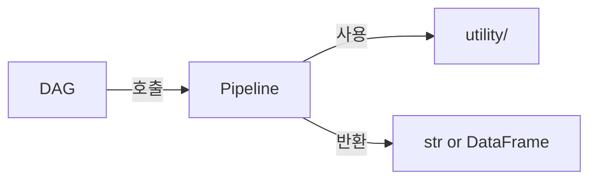

# 파이프라인 개발 규칙

## 작성 규칙
- 반환: str(XCom 메시지) 또는 DataFrame
- 내부 로직은 `_접두사` private 함수로 분리, utility 함수 우선 사용

## 파이프라인 위치
- `pipelines/sales/` - SMD_* 주문/영업 파이프라인
- `pipelines/strategy/` - SMP_* 전략 파이프라인
- `pipelines/db/` - DB_* 원천 수집 및 검증 파이프라인

## DB_UnifiedSales 패턴
소스별 파일로 분리, `common.py`가 스키마·저장 공유:
- `DB_UnifiedSales_common.py` — UNIFIED_COLUMNS, _save_unified_daily, _normalize_item_key
- `DB_UnifiedSales_{source}.py` — 소스별 변환 (okpos/unionpos/easypos/posfeed/toorder)
- posfeed whitelist: `fin_product_posfeed_whitelist.csv`
  - 컬럼: `item_name, is_valid, store, review_needed, classified_by`
  - 신규 item → `_classify_item_with_llm()` (qwen_client) 자동 분류 → `review_needed=Y`
  - `is_valid=N` → `sync_posfeed_blacklist()`로 기존 parquet 소급 삭제

## 참조
- `docs/architecture.md` - utility 선택 기준표
- `docs/db-schema.md` - DB/경로 참조
