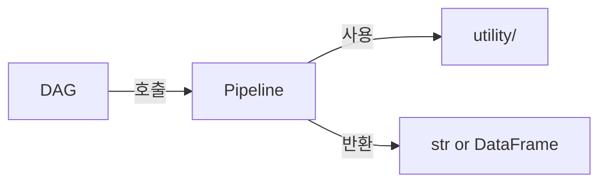

# 파이프라인 개발 규칙

```mermaid
graph LR
    DAG -->|호출| Pipeline
    Pipeline -->|사용| Utility[utility/]
    Pipeline -->|반환| XCom[str or DataFrame]
```

## 작성 규칙
- 반환: str(XCom 메시지) 또는 DataFrame
- 내부 로직은 `_접두사` private 함수로 분리, utility 함수 우선 사용

## 참조
- `docs/architecture.md` - utility 선택 기준표
