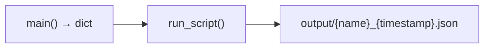

# 스크립트 규칙



## 목적
분석/검증용 단발성 스크립트 (DAG 아님), 결과는 `scripts/output/`에 JSON 자동 저장

## 구조
- `main()` → dict(meta/summary/stats) 반환
- `_base.run_script()`로 예외 처리 + 저장, logger 필수
- 경로는 `paths.py` 상수, 필터는 argparse 사용

## 실행
```bash
# WSL에서 .venv_wsl 활성화 후
python scripts/{name}.py [--date YYYY-MM-DD]
# 결과: scripts/output/{name}_{timestamp}.json 자동 저장
```

## 참조
- `scripts/_base.py` - run_script, save_summary
- `docs/architecture.md` - 아키텍처
